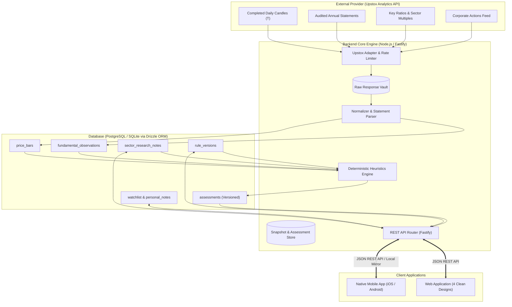

# Stock Advisory — Backend Architecture & API Specification

**Document Version:** 1.0  
**Target:** Web Application & Native Mobile Application Integration  
**Aligned With:** [APP_REQUIREMENTS.md](file:///C:/Users/aidev/Documents/app_idea/stock_advisory/APP_REQUIREMENTS.md), [BACKEND_REQUIREMENTS.md](file:///C:/Users/aidev/Documents/app_idea/stock_advisory/BACKEND_REQUIREMENTS.md), [BUILD_PLAN.md](file:///C:/Users/aidev/Documents/app_idea/stock_advisory/BUILD_PLAN.md)  
**Mockup Reference:** [mockup_by_agy/](file:///C:/Users/aidev/Documents/app_idea/stock_advisory/mockup_by_agy/) (Web & Mobile Suite)

---

## 1. Architectural Blueprint & Data Flow

The backend system is designed around one core invariant: **Page visits and mobile requests must read from high-performance, deterministic pre-calculated local snapshots.** The app must never execute live, slow, rate-limited Upstox API calls on user request.



### Ingestion & Calculation Pipeline
1. **Trigger Phase**: A manual refresh or completed exchange session trigger starts an asynchronous ingestion job (`POST /api/refresh`).
2. **Provider Fetch Phase**: The Upstox Adapter fetches completed daily candles, corporate action records, key ratios, and consolidated statements while enforcing rate limits.
3. **Normalization Phase**: Raw responses are immutably archived. Numbers, statements, and ratios are parsed into normalized Indian Rupee (₹ in Crore) structures with explicit financial period tags.
4. **Assessment Engine Phase**: The 4-pillar quality checks, valuation discount vs Upstox sector benchmark, and sourced sector notes are evaluated under strict precedence rules.
5. **Snapshot Publication**: The calculated assessments are committed atomically under a unique snapshot ID (`SNP-YYYYMMDD-XXX`) with rule version tags (`v1.2`).
6. **API Serving Phase**: Client web and mobile apps query cached assessments in under 100ms.

---

## 2. Tech Stack Evaluation & Decision Guide

You are considering **Pure Node.js**, **Pure Supabase**, or a **Hybrid (Node.js + Supabase)**. Below is an objective, deep-dive comparison across all key technical and business criteria.

### Comparison Matrix

| Evaluation Dimension | 1. Pure Node.js (TypeScript + Fastify + SQLite/PG) | 2. Pure Supabase (PostgreSQL + PostgREST + Edge Functions) | 3. Hybrid: Node.js Engine + Supabase Managed PG & Auth (Recommended) |
|---|---|---|---|
| **Deterministic Engine Complexity** | **Highest (10/10)**: TypeScript enables clean, type-safe financial formula pipelines, unit tests, and easy precedence logic. | **Low (4/10)**: Complex financial heuristics, corporate action adjustments, and multi-period statement parsing are awkward in PL/pgSQL or serverless Deno edge functions. | **Highest (10/10)**: All complex financial math and Upstox ingestion live in robust Node.js services; Supabase handles durable persistence. |
| **Upstox Secret Security** | **Excellent**: Upstox token is kept strictly in local environment variables (`.env`). No external exposure. | **Moderate**: Must ensure client API keys never leak Upstox credentials; requires strict Edge Function secret boundaries. | **Excellent**: Node.js server securely holds the token; mobile and web clients communicate only with Node.js endpoints. |
| **Mobile App Integration** | **Good**: Mobile app calls REST API. If remote, requires deploying Node.js to a server (Render, Railway, Fly.io). | **Excellent**: Instant Supabase Mobile SDKs, built-in Auth, offline caching, and real-time database listeners out of the box. | **Excellent**: Mobile app can authenticate via Supabase Auth, read fast cached snapshots from Node.js, and sync local SQLite notes. |
| **Offline & Local Resilience** | **Native**: Can run 100% locally with zero cloud dependencies using local SQLite. Survives internet outages. | **Cloud-Dependent**: Relies on connection to Supabase cloud. Local development requires running full Docker Supabase stack. | **High**: Node.js backend can run locally against SQLite for dev/testing, and seamlessly connect to Supabase PG for mobile release. |
| **Developer Velocity (MVP)** | **Fastest**: Single repository, zero cloud setup, instant Vitest/Jest unit tests for all financial rules. | **Medium**: Requires writing SQL migration scripts, RLS policies, and debugging edge functions in Deno. | **Very High**: Fast local TypeScript iteration; switch database URL to Supabase when preparing for mobile app handover. |
| **Infrastructure Cost** | **$0 / Free**: Runs locally on your machine for personal MVP. | **Free Tier**: Supabase generous free tier covers 500MB DB and 50,000 MAU. | **$0–$5/mo**: Node.js runs locally or on a $5/mo VPS / free tier container; Supabase database is free. |

### Architectural Deep Dive: Why Pure Supabase is Inadequate on its Own
A pure Supabase approach (using PostgREST and Supabase Edge Functions) works well for generic CRUD apps (blogs, e-commerce, simple social apps). However, this application is a **specialized financial heuristics engine**:
1. **Multi-Source Ingestion & Batch Invalidation**: A single refresh run fetches multiple years of consolidated balance sheets, P&L statements, cash flow statements, corporate action split factors, and daily candle arrays. Orchestrating this inside 150-second Edge Function execution limits is brittle.
2. **Deterministic Versioning**: `BACKEND_REQUIREMENTS.md` mandates that every change to a rule threshold (e.g. changing ROCE from 15% to 16%) must recalculate the covered universe and version the outcome (`v1.2 → v1.3`). Doing this in pure SQL triggers is difficult to maintain and test.
3. **Unit Testability**: A financial advisory app requires unit tests verifying that non-positive earnings, bonus splits, and unverified data can *never* produce an accidental "Worth researching" recommendation. In Node.js/TypeScript, you can write unit tests that run in milliseconds before touching any database.

### Definitive Recommendation: The Pragmatic Hybrid Path

> [!IMPORTANT]
> **Recommended Strategy: Modular Node.js / Fastify Engine + Drizzle ORM + Supabase PostgreSQL**
> 1. **Core Backend**: Write the API server and assessment engine in **Node.js (TypeScript) using Fastify**. Fastify is 3–4x faster than Express, has built-in schema validation via TypeBox or Zod, and exports OpenAPI/Swagger documentation for your mobile developer.
> 2. **Database Layer (Drizzle ORM)**: Use **Drizzle ORM**. Drizzle is lightweight, SQL-native, and allows you to write your schema once. During Phase 1 (MVP local development), you can run it against **local SQLite** (`stock_advisory.db`). When your mobile developer starts building the mobile app, you simply point Drizzle's database connection string to **Supabase Managed PostgreSQL** without rewriting a single line of backend logic!
> 3. **Mobile Handoff**: The mobile developer interacts with clean, documented JSON REST endpoints, while Supabase provides managed database backups, SSL connections, and user authentication if you later add multi-device login.

---

## 3. Comprehensive REST API Contract

Below is the complete specification of all endpoints required by the Web and Mobile applications.

### Standard Response Envelopes

#### Success Envelope
```json
{
  "status": "success",
  "data": { ... },
  "meta": {
    "snapshotId": "SNP-20260924-001",
    "dataTimestamp": "2026-09-25T09:30:00+05:30",
    "tradingDate": "2026-09-24",
    "ruleVersion": "v1.2",
    "researchHorizon": "1–3 Years",
    "warnings": []
  }
}
```

#### Error Envelope
```json
{
  "status": "error",
  "error": {
    "code": "CORPORATE_ACTION_UNVERIFIED",
    "message": "Candidate disqualified due to unresolved corporate action price distortion.",
    "retryable": false,
    "details": { "isin": "INE280A01028", "event": "1:1 Bonus Issue" }
  }
}
```

---

### Endpoint Catalog

| Screen / Feature | Method & Route | Purpose |
|---|---|---|
| **System** | `GET /api/status` | System health, Upstox token validity, rate limits, active snapshot ID |
| **APP-01** | `GET /api/brief` | Market/sector stress, qualified opportunities, watch queue, exclusions |
| **APP-02** | `GET /api/companies/:isin` | Deep-dive dossier, trigger explanation, 3-yr statements, rule audit, headwinds |
| **APP-03** | `GET /api/watchlist` | Retrieve saved companies with latest assessment conclusions |
| **APP-03** | `PUT /api/watchlist/:isin` | Add company to persistent watchlist |
| **APP-03** | `DELETE /api/watchlist/:isin` | Remove company from persistent watchlist |
| **APP-03** | `PUT /api/companies/:isin/personal-note` | Persist investment thesis, specific concerns, and next review date |
| **APP-04** | `GET /api/companies` | Screener table with multi-factor filters and explicit sorting (nulls last) |
| **APP-04** | `GET /api/compare` | Side-by-side comparison for up to 3 companies with cross-sector warnings |
| **APP-05** | `GET /api/research-notes` | List sourced sector research notes |
| **APP-05** | `POST /api/research-notes` | Create a new sourced sector research note |
| **APP-05** | `PUT /api/research-notes/:id` | Update note & trigger automatic assessment invalidation |
| **APP-05** | `DELETE /api/research-notes/:id` | Delete note & trigger recalculation |
| **APP-05** | `GET /api/settings/rules` | View active screening heuristic thresholds and version |
| **APP-05** | `PUT /api/settings/rules` | Update thresholds, bump rule version (`v1.2 → v1.3`), recalculate universe |
| **Refresh** | `POST /api/refresh` | Trigger async manual ingestion & assessment run (Returns 202 Accepted) |
| **Refresh** | `GET /api/refresh/:jobId` | Poll progress, resource logs, and completion status |

---

### Detailed Endpoint Specifications

#### 1. System Health & Diagnostics
`GET /api/status`

- **Purpose**: Verify local database state, Upstox Analytics API token health, and data freshness.
- **Request Headers**: None required.
- **Response `200 OK`**:
```json
{
  "status": "success",
  "data": {
    "systemHealth": "healthy",
    "provider": {
      "name": "Upstox Analytics API",
      "authenticated": true,
      "tokenValidUntil": "2027-08-14",
      "quotaRemainingToday": 4850,
      "quotaLimitToday": 5000,
      "lastPingLatencyMs": 142
    },
    "storage": {
      "type": "PostgreSQL (Supabase)",
      "coveredUniverseCount": 5,
      "totalConfiguredUniverse": 35,
      "latestCompletedSession": "2026-09-24",
      "activeSnapshotId": "SNP-20260924-001",
      "activeRuleVersion": "v1.2"
    }
  }
}
```

---

#### 2. Opportunity Brief (Home Page)
`GET /api/brief`

- **Purpose**: Powers Screen APP-01 on Web and Mobile.
- **Query Parameters**:
  - `window` *(optional, string)*: `'day'` (default, $\le -2\%$) or `'month'` ($\le -8\%$).
  - `sector` *(optional, string)*: Filter by sector ID (e.g. `'it'`, `'fmcg'`, `'pharma'`).
- **Response `200 OK`**:
```json
{
  "status": "success",
  "data": {
    "discoveryWindow": {
      "selected": "day",
      "threshold": -2.0,
      "effectiveSession": "2026-09-24"
    },
    "benchmarks": {
      "broadMarket": {
        "symbol": "NIFTY_50",
        "name": "NIFTY 50",
        "type": "Official Exchange Index",
        "latestClose": 25120.40,
        "dailyChangePercent": -1.35,
        "monthlyChangePercent": -3.40
      },
      "sectors": [
        {
          "id": "it",
          "name": "Nifty IT Proxy",
          "isProxy": true,
          "proxyDisclosure": "Locally constructed equal-weight basket of 5 liquid IT stocks used as proxy.",
          "dailyChangePercent": -2.40,
          "monthlyChangePercent": -7.10
        },
        {
          "id": "fmcg",
          "name": "Nifty FMCG",
          "isProxy": false,
          "dailyChangePercent": -1.10,
          "monthlyChangePercent": -2.80
        },
        {
          "id": "pharma",
          "name": "Nifty Healthcare",
          "isProxy": false,
          "dailyChangePercent": -0.75,
          "monthlyChangePercent": -1.65
        }
      ]
    },
    "candidates": {
      "worthResearching": [
        {
          "isin": "INE467B01029",
          "ticker": "TCS",
          "name": "Tata Consultancy Services Ltd",
          "sectorId": "it",
          "sectorName": "Information Technology",
          "currentPrice": 4180.50,
          "priceDate": "2026-09-24",
          "windowChangePercent": -2.85,
          "sectorChangePercent": -2.40,
          "conclusion": "Worth researching",
          "triggerStatement": "Fell -2.85% today (proxy -2.40%), meeting the -2.0% daily discovery trigger.",
          "keyChecks": {
            "pe": { "value": "28.4x", "status": "pass", "benchmark": "32.1x (Upstox IT Sector)" },
            "roce": { "value": "48.2%", "status": "pass", "threshold": ">= 15.0%" },
            "debtEquity": { "value": "0.08x", "status": "pass", "threshold": "<= 1.00x" }
          },
          "sectorHeadwind": "Global enterprise discretionary tech budget reprioritization.",
          "nextChecks": [
            { "task": "Verify Q2 FY27 Total Contract Value deal wins", "targetDate": "2026-10-15", "done": false }
          ],
          "inWatchlist": true
        }
      ],
      "watchAndWait": [
        {
          "isin": "INE009A01021",
          "ticker": "INFY",
          "name": "Infosys Limited",
          "sectorId": "it",
          "sectorName": "Information Technology",
          "currentPrice": 1820.00,
          "windowChangePercent": -2.30,
          "conclusion": "Watch and wait",
          "reason": "Quality checks pass, but senior leadership turnover and conservative guidance create near-term uncertainty."
        }
      ]
    },
    "exclusionsSummary": {
      "totalCovered": 5,
      "qualifiedCount": 2,
      "watchCount": 1,
      "failedValuationCount": 1,
      "disqualifiedCorpActionCount": 1,
      "breakdown": [
        { "isin": "INE021A01026", "ticker": "ASIANPAINT", "reason": "Valuation Fail: P/E 46.5x exceeds sector benchmark 41.2x" },
        { "isin": "INE280A01028", "ticker": "TITAN", "reason": "Disqualified: Unverified 1:1 bonus issue corporate action distortion" }
      ]
    }
  }
}
```

---

#### 3. Company Deep Dossier
`GET /api/companies/:isin`

- **Purpose**: Powers Screen APP-02 (Detailed Company Analysis).
- **Parameters**: `:isin` (Path parameter, 12-character ISIN e.g. `INE467B01029`).
- **Response `200 OK`**:
```json
{
  "status": "success",
  "data": {
    "profile": {
      "isin": "INE467B01029",
      "ticker": "TCS",
      "name": "Tata Consultancy Services Ltd",
      "exchange": "NSE",
      "exchangeKey": "NSE_EQ|INE467B01029",
      "sector": "Information Technology",
      "industry": "IT Consulting & Software"
    },
    "marketData": {
      "price": 4180.50,
      "sessionDate": "2026-09-24",
      "dailyChangePercent": -2.85,
      "monthlyChangePercent": -8.45,
      "sectorDailyChange": -2.40,
      "corporateActionStatus": "Verified clean (No bonus/split distortions)"
    },
    "triggerAudit": {
      "appearedInBrief": true,
      "explanation": "Stock fell -2.85% on 2026-09-24 against sector proxy drop of -2.40% over identical session boundaries."
    },
    "financials": [
      {
        "period": "FY23",
        "basis": "Consolidated",
        "revenueCr": 225458,
        "netProfitCr": 42147,
        "operatingCashFlowCr": 41961,
        "capexCr": 3142,
        "freeCashFlowCr": 38819
      },
      {
        "period": "FY24",
        "basis": "Consolidated",
        "revenueCr": 240893,
        "netProfitCr": 45908,
        "operatingCashFlowCr": 44342,
        "capexCr": 3310,
        "freeCashFlowCr": 41032
      },
      {
        "period": "FY25",
        "basis": "Consolidated",
        "revenueCr": 255100,
        "netProfitCr": 48450,
        "operatingCashFlowCr": 46800,
        "capexCr": 3450,
        "freeCashFlowCr": 43350
      }
    ],
    "checksAudit": [
      {
        "id": "net_profit",
        "name": "Annual Net Profit",
        "rule": "Latest annual net profit > 0",
        "evaluatedValue": "₹48,450 Cr",
        "status": "pass",
        "period": "FY25 Annual Consolidated",
        "evidence": "Audited FY25 PAT is positive and expanded 5.5% YoY."
      },
      {
        "id": "operating_cashflow",
        "name": "Operating Cash Flow",
        "rule": "Latest annual operating cash flow > 0",
        "evaluatedValue": "₹46,800 Cr",
        "status": "pass",
        "period": "FY25 Annual Consolidated",
        "evidence": "Cash conversion ratio (OCF/PAT) stands at 96.6%."
      },
      {
        "id": "roce",
        "name": "Return on Capital Employed",
        "rule": "ROCE >= 15.0%",
        "evaluatedValue": "48.2%",
        "status": "pass",
        "period": "FY25 Consolidated",
        "evidence": "Asset-light service operations deliver 48.2% return on capital."
      },
      {
        "id": "debt_equity",
        "name": "Total Debt / Equity",
        "rule": "Total Debt / Equity <= 1.00x",
        "evaluatedValue": "0.08x",
        "status": "pass",
        "period": "FY25 Consolidated",
        "evidence": "Total debt is ₹7,210 Cr (operating lease liabilities) vs Net Worth ₹90,120 Cr."
      },
      {
        "id": "valuation_pe",
        "name": "Valuation vs Benchmark",
        "rule": "Positive P/E < Upstox sector benchmark",
        "evaluatedValue": "28.4x P/E",
        "status": "pass",
        "period": "TTM / Session 2026-09-24",
        "evidence": "Company trades at 28.4x P/E vs Upstox IT sector benchmark of 32.1x (11.5% discount)."
      }
    ],
    "sectorContext": {
      "noteTitle": "Global Enterprise Discretionary IT Spend Softening",
      "classification": "Potentially temporary",
      "severity": "Caution",
      "sourceUrl": "https://economictimes.indiatimes.com/tech/ites/gartner-it-spending-forecast",
      "reviewedDate": "2026-09-20",
      "nextReviewDate": "2026-10-20",
      "headwind": "Client discretionary spend paused; deal ramp-ups slower than anticipated.",
      "recoveryConditions": "North American banking deal cycle turnaround in Q4.",
      "invalidationCriteria": "Two consecutive quarters of TCV order-book drop > 8%."
    },
    "companySpecificRisks": [
      "Wage hikes in Q1/Q2 could compress margins if pricing power does not offset inflation.",
      "USD/INR exchange rate volatility."
    ],
    "nextChecks": [
      { "task": "Verify Q2 FY27 Total Contract Value new deal wins", "targetDate": "2026-10-15", "done": false },
      { "task": "Check EBIT margin resilience against employee wage increments", "targetDate": "2026-10-15", "done": false }
    ],
    "personalNotes": {
      "savedInWatchlist": true,
      "thesis": "Tier-1 IT leader with fortress balance sheet, 48% ROCE, and >95% free cash flow conversion.",
      "concerns": "Extended slowdown in North American BFSI deal velocity.",
      "nextReviewDate": "2026-10-15"
    }
  }
}
```

---

#### 4. Watchlist & Personal Notes Management
- `GET /api/watchlist` — Retrieve saved stocks with latest data date and research conclusions.
- `PUT /api/watchlist/:isin` — Add stock to watchlist (idempotent).
- `DELETE /api/watchlist/:isin` — Remove stock from watchlist.
- `PUT /api/companies/:isin/personal-note` — Update thesis, concerns, and review target.

**Update Note Request `PUT /api/companies/:isin/personal-note`**:
```json
{
  "thesis": "High margin custom synthesis moat; entering GLP-1 supply chain.",
  "concerns": "Delay in patent expiries and solvent intermediate pricing.",
  "nextReviewDate": "2026-10-28"
}
```
**Response `200 OK`**:
```json
{
  "status": "success",
  "data": {
    "isin": "INE361B01024",
    "updatedAt": "2026-09-25T17:45:00+05:30",
    "persisted": true
  }
}
```

---

#### 5. Explore & Multi-Stock Compare
`GET /api/companies`

- **Purpose**: Powers Screen APP-04 screener table.
- **Query Parameters**:
  - `sector` *(optional)*: `'it'`, `'fmcg'`, `'pharma'`
  - `conclusion` *(optional)*: `'Worth researching'`, `'Watch and wait'`, etc.
  - `sort` *(optional)*: `'decline_day'`, `'decline_month'`, `'pe'`, `'roce'`
  - `search` *(optional)*: Ticker or company name query string
- **Note**: Backend enforces that records with unavailable or unverified figures sort strictly last.

`GET /api/compare`

- **Purpose**: Side-by-side 3-company comparison matrix.
- **Query Parameters**: `isins=INE467B01029,INE009A01021,INE021A01026`
- **Response `200 OK`**:
```json
{
  "status": "success",
  "data": {
    "crossSectorFlag": true,
    "crossSectorWarning": "Comparison spans multiple sectors (Information Technology vs Fast Moving Consumer Goods). Operating models and valuation ratios cannot be compared as direct substitutes.",
    "periodMismatchFlag": false,
    "companies": [
      {
        "isin": "INE467B01029",
        "ticker": "TCS",
        "sector": "Information Technology",
        "conclusion": "Worth researching",
        "price": 4180.50,
        "dailyChangePercent": -2.85,
        "pe": "28.4x",
        "roce": "48.2%",
        "debtEquity": "0.08x",
        "fcfCr": 43350
      },
      {
        "isin": "INE009A01021",
        "ticker": "INFY",
        "sector": "Information Technology",
        "conclusion": "Watch and wait",
        "price": 1820.00,
        "dailyChangePercent": -2.30,
        "pe": "23.8x",
        "roce": "38.6%",
        "debtEquity": "0.10x",
        "fcfCr": 23400
      },
      {
        "isin": "INE021A01026",
        "ticker": "ASIANPAINT",
        "sector": "Fast Moving Consumer Goods & Paints",
        "conclusion": "Fundamental concerns",
        "price": 2740.00,
        "dailyChangePercent": -3.80,
        "pe": "46.5x",
        "roce": "27.4%",
        "debtEquity": "0.18x",
        "fcfCr": 2100
      }
    ]
  }
}
```

---

#### 6. Settings, Rule Versioning & Recalculation
`GET /api/settings/rules` & `PUT /api/settings/rules`

- **Purpose**: View and adjust active screening heuristic thresholds. Modifying any threshold increments the rule version (`v1.2 → v1.3`), recalculates all assessments across the universe, and archives the previous version.
- **Request Body (`PUT`)**:
```json
{
  "minRoce": 16.0,
  "maxDebtEquity": 0.85,
  "dailyDeclineTrigger": -2.0,
  "monthlyDeclineTrigger": -8.0,
  "changeReason": "Tightened balance sheet leverage criteria"
}
```
- **Response `200 OK`**:
```json
{
  "status": "success",
  "data": {
    "newRuleVersion": "v1.3",
    "effectiveAt": "2026-09-25T17:48:00+05:30",
    "recalculatedUniverseCount": 5,
    "changesDetected": {
      "previousWorthResearching": 2,
      "newWorthResearching": 2
    }
  }
}
```

---

#### 7. Snapshot Refresh Job
- `POST /api/refresh` — Starts an asynchronous refresh job. Returns `202 Accepted` with a `jobId`.
- `GET /api/refresh/:jobId` — Polls job progress.

**Progress Response `GET /api/refresh/JOB-20260925-081`**:
```json
{
  "status": "success",
  "data": {
    "jobId": "JOB-20260925-081",
    "state": "running",
    "progressPercent": 60,
    "processedCount": 3,
    "totalCount": 5,
    "currentResource": "Fetching statements for DIVISLAB (Pharma)",
    "errors": []
  }
}
```

---

## 4. Database Schema (PostgreSQL / Supabase DDL)

Below is the production DDL schema compatible with Supabase (PostgreSQL 15+) or SQLite:

```sql
-- 1. Covered Companies Universe
CREATE TABLE IF NOT EXISTS companies (
  isin VARCHAR(12) PRIMARY KEY,
  ticker VARCHAR(20) NOT NULL UNIQUE,
  name VARCHAR(120) NOT NULL,
  exchange VARCHAR(10) NOT NULL DEFAULT 'NSE',
  exchange_key VARCHAR(50) NOT NULL UNIQUE,
  sector_id VARCHAR(30) NOT NULL,
  sector_name VARCHAR(80) NOT NULL,
  industry VARCHAR(80),
  is_active BOOLEAN NOT NULL DEFAULT TRUE,
  created_at TIMESTAMPTZ NOT NULL DEFAULT NOW()
);

-- 2. Daily Price Bars (Completed Sessions Only)
CREATE TABLE IF NOT EXISTS price_bars (
  id BIGSERIAL PRIMARY KEY,
  isin VARCHAR(12) NOT NULL REFERENCES companies(isin),
  session_date DATE NOT NULL,
  open_price NUMERIC(12, 2) NOT NULL,
  high_price NUMERIC(12, 2) NOT NULL,
  low_price NUMERIC(12, 2) NOT NULL,
  close_price NUMERIC(12, 2) NOT NULL,
  previous_close NUMERIC(12, 2) NOT NULL,
  daily_return_pct NUMERIC(6, 3) NOT NULL,
  is_corporate_action_adjusted BOOLEAN NOT NULL DEFAULT TRUE,
  retrieved_at TIMESTAMPTZ NOT NULL DEFAULT NOW(),
  CONSTRAINT uq_price_bar UNIQUE (isin, session_date)
);

-- 3. Normalized Annual Statements
CREATE TABLE IF NOT EXISTS fundamental_observations (
  id BIGSERIAL PRIMARY KEY,
  isin VARCHAR(12) NOT NULL REFERENCES companies(isin),
  financial_period VARCHAR(10) NOT NULL, -- 'FY23', 'FY24', 'FY25'
  statement_basis VARCHAR(15) NOT NULL DEFAULT 'Consolidated', -- 'Consolidated' or 'Standalone'
  revenue_cr NUMERIC(14, 2) NOT NULL,
  net_profit_cr NUMERIC(14, 2) NOT NULL,
  operating_cash_flow_cr NUMERIC(14, 2) NOT NULL,
  capital_expenditure_cr NUMERIC(14, 2) NOT NULL,
  derived_free_cash_flow_cr NUMERIC(14, 2) NOT NULL, -- OCF - Capex
  shareholder_equity_cr NUMERIC(14, 2) NOT NULL,
  total_debt_cr NUMERIC(14, 2) NOT NULL,
  roce_pct NUMERIC(6, 2) NOT NULL,
  filing_date DATE,
  retrieved_at TIMESTAMPTZ NOT NULL DEFAULT NOW(),
  CONSTRAINT uq_statement UNIQUE (isin, financial_period, statement_basis)
);

-- 4. Key Ratios & Provider Benchmarks
CREATE TABLE IF NOT EXISTS ratio_snapshots (
  id BIGSERIAL PRIMARY KEY,
  isin VARCHAR(12) NOT NULL REFERENCES companies(isin),
  as_of_session DATE NOT NULL,
  pe_ratio NUMERIC(8, 2),
  pe_earnings_basis VARCHAR(40) DEFAULT 'TTM Consolidated EPS',
  provider_sector_pe_benchmark NUMERIC(8, 2) NOT NULL,
  provider_benchmark_label VARCHAR(60) NOT NULL DEFAULT 'Upstox sector benchmark',
  retrieved_at TIMESTAMPTZ NOT NULL DEFAULT NOW()
);

-- 5. Sourced Sector Research Notes
CREATE TABLE IF NOT EXISTS sector_research_notes (
  id VARCHAR(40) PRIMARY KEY,
  sector_id VARCHAR(30) NOT NULL,
  sector_name VARCHAR(80) NOT NULL,
  title VARCHAR(200) NOT NULL,
  source_title VARCHAR(150) NOT NULL,
  source_url TEXT NOT NULL,
  published_date DATE NOT NULL,
  reviewed_date DATE NOT NULL,
  next_review_date DATE NOT NULL,
  pressure_classification VARCHAR(30) NOT NULL CHECK (pressure_classification IN ('potentially_temporary', 'potentially_structural', 'mixed', 'unknown')),
  severity VARCHAR(30) NOT NULL CHECK (severity IN ('informational', 'caution', 'material_concern')),
  summary TEXT NOT NULL,
  potential_impact TEXT,
  recovery_conditions TEXT,
  invalidation_criteria TEXT,
  updated_at TIMESTAMPTZ NOT NULL DEFAULT NOW()
);

-- 6. Watchlist & Personal Theses (Local or Supabase)
CREATE TABLE IF NOT EXISTS watchlist (
  isin VARCHAR(12) PRIMARY KEY REFERENCES companies(isin) ON DELETE CASCADE,
  added_at TIMESTAMPTZ NOT NULL DEFAULT NOW()
);

CREATE TABLE IF NOT EXISTS personal_notes (
  isin VARCHAR(12) PRIMARY KEY REFERENCES companies(isin) ON DELETE CASCADE,
  thesis TEXT,
  concerns TEXT,
  next_review_date DATE,
  updated_at TIMESTAMPTZ NOT NULL DEFAULT NOW()
);

-- 7. Rule Versions
CREATE TABLE IF NOT EXISTS rule_versions (
  version_tag VARCHAR(20) PRIMARY KEY, -- 'v1.2', 'v1.3'
  min_roce NUMERIC(5, 2) NOT NULL DEFAULT 15.0,
  max_debt_equity NUMERIC(5, 2) NOT NULL DEFAULT 1.0,
  daily_decline_trigger NUMERIC(5, 2) NOT NULL DEFAULT -2.0,
  monthly_decline_trigger NUMERIC(5, 2) NOT NULL DEFAULT -8.0,
  created_at TIMESTAMPTZ NOT NULL DEFAULT NOW()
);

-- 8. Final Deterministic Assessments
CREATE TABLE IF NOT EXISTS assessments (
  id BIGSERIAL PRIMARY KEY,
  snapshot_id VARCHAR(40) NOT NULL,
  isin VARCHAR(12) NOT NULL REFERENCES companies(isin),
  session_date DATE NOT NULL,
  rule_version VARCHAR(20) NOT NULL REFERENCES rule_versions(version_tag),
  conclusion VARCHAR(30) NOT NULL CHECK (conclusion IN ('Worth researching', 'Watch and wait', 'Fundamental concerns', 'Insufficient evidence')),
  checks_json JSONB NOT NULL,
  next_checks_json JSONB NOT NULL,
  calculated_at TIMESTAMPTZ NOT NULL DEFAULT NOW(),
  CONSTRAINT uq_assessment UNIQUE (snapshot_id, isin, rule_version)
);

CREATE INDEX IF NOT EXISTS idx_assessment_lookup ON assessments(snapshot_id, conclusion);
```

---

## 5. Assessment Rules Engine Execution Pipeline

The backend evaluates every stock through a strict deterministic state machine:

```
[Candidate Trigger Evaluation]
       │
       ▼
[Corporate Action Verification Gate] ──(Unresolved Split/Bonus)──► [Insufficient Evidence]
       │
       ▼
[4-Pillar Quality Checks] ───────────(Any Quality Fail)─────────► [Fundamental Concerns]
 (Profit > 0, OCF > 0, ROCE >= 15%, D/E <= 1.0)
       │
       ▼
[Valuation Benchmark Check] ─────────(P/E >= Benchmark)─────────► [Watch and Wait]
 (P/E < Upstox Sector Benchmark)
       │
       ▼
[Sector Context & Review Freshness] ─(Stale Review > 30d)──────► [Insufficient Evidence]
       │
       ▼
[Sourced Headwind Severity Check] ───(Material Concern)────────► [Fundamental Concerns]
       │                              (Caution / Mixed)─────────► [Watch and Wait]
       │
       ▼
[ALL GATES PASSED] ─────────────────────────────────────────────► [Worth Researching]
```

### Precedence Hierarchy (Strict Execution Order)
1. **Fundamental Concerns**:
   - Any required quality check fails (e.g., negative net profit, negative operating cash flow, ROCE $< 15\%$, Debt/Equity $> 1.0$).
   - OR verified material adverse business deterioration in reviewed sector context.
2. **Insufficient Evidence**:
   - Required financial observation or ratio is missing or stale.
   - OR unverified corporate action distortion within the price return comparison window.
   - OR sector research note is missing or older than 30 days.
3. **Watch and Wait**:
   - All quality checks pass, but company P/E is above the sector benchmark.
   - OR reviewed sector context carries active caution flags (e.g. leadership churn, interim margin pressure).
4. **Worth Researching**:
   - Company crossed discovery decline trigger.
   - Passed all 4 quality checks.
   - Passed valuation discount check vs Upstox sector benchmark.
   - Up-to-date qualitative review has no unresolved material concerns.

---

## 6. Implementation Roadmap for Backend Developer

### Step 1: Project Initialization
- Initialize TypeScript project with Fastify: `npm init -y && npm install fastify @fastify/cors @fastify/swagger drizzle-orm pg dotenv`
- Define Drizzle ORM schema matching Section 4.
- Configure `.env` with `UPSTOX_TOKEN`, `DATABASE_URL` (local SQLite or Supabase PG), and `PORT=3000`.

### Step 2: Ingestion & Rules Engine
- Build `UpstoxAdapter` to fetch completed daily candles and statements for 5 verification companies (TCS, INFY, ASIANPAINT, DIVISLAB, TITAN).
- Implement `AssessmentEngine` with unit tests covering all precedence branches.
- Verify that Titan is disqualified for its 1:1 bonus issue distortion and Asian Paints is flagged for P/E valuation failure.

### Step 3: API Route Deployment
- Implement routes `/api/status`, `/api/brief`, `/api/companies/:isin`, `/api/watchlist`, `/api/compare`, and `/api/settings/rules`.
- Wire frontend web prototypes and mobile prototypes to fetch from `http://localhost:3000/api/*`.
